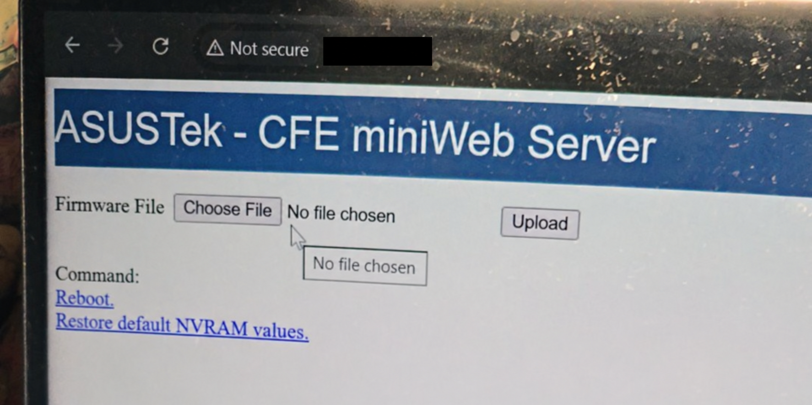
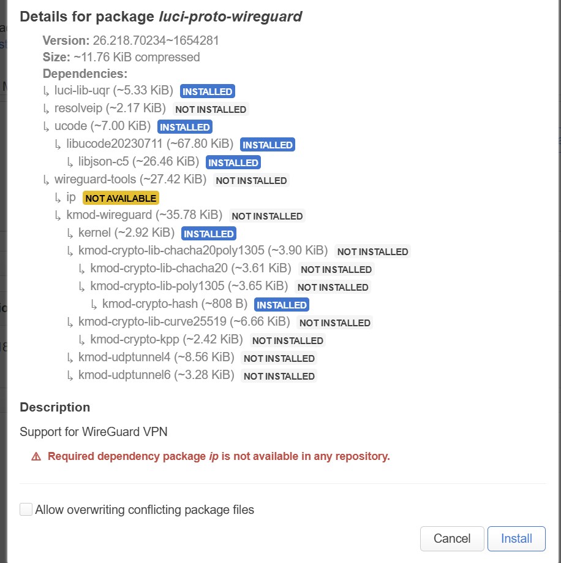
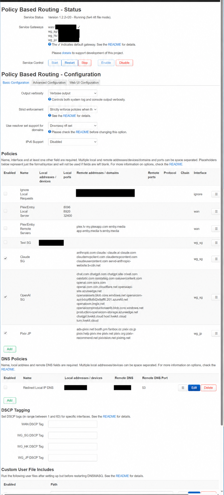
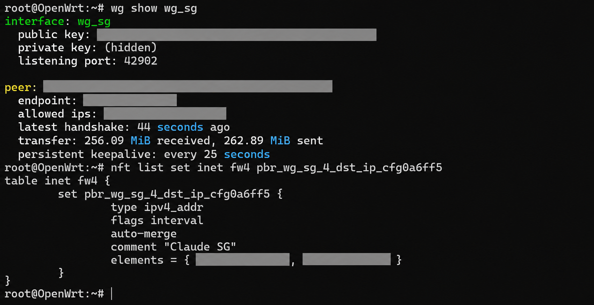
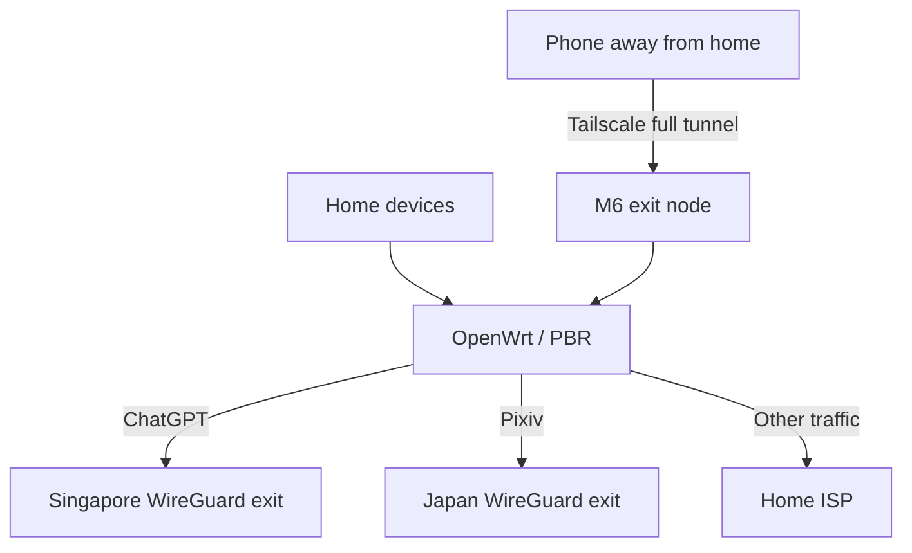
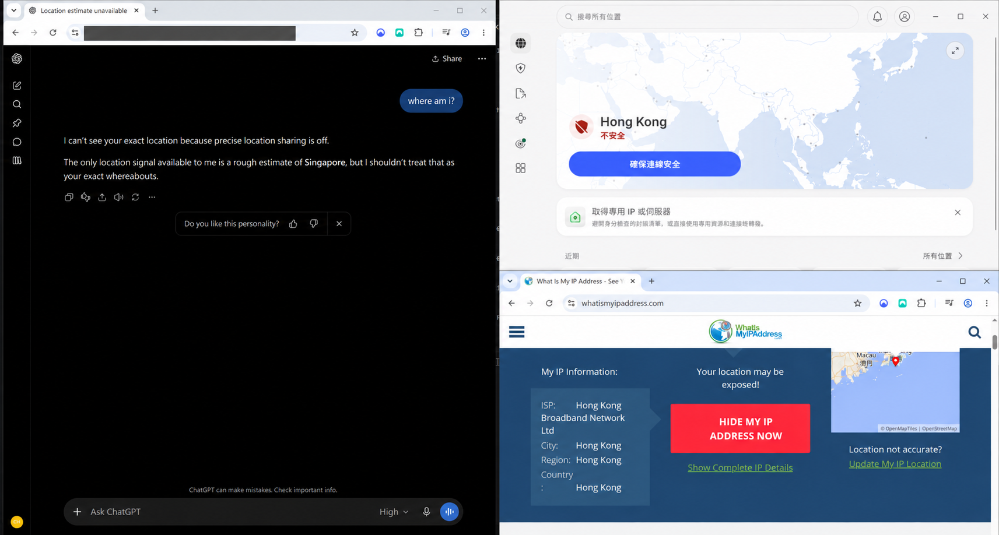

## Overview

I set up OpenWrt to send ChatGPT traffic through a VPN automatically, while keeping other sites on my normal connection. I also wanted my phone to connect back home through Tailscale and use the same routing when I was out.

This setup was inspired by [Eric Leung's post about using OpenAI from Hong Kong](https://ericleung.dev/posts/009_subscribing_to_openai/), especially the OpenWrt and Tailscale sections.

Like [my Hugo migration](), I used AI to help work through it, sending screenshots and terminal output whenever I got stuck. I've covered the keys and network addresses in the pictures below.

## Setting up OpenWrt

I had an old ASUS RT-AC68U sitting around, so I used it as the main router. I kept my NETGEAR SXR50 mesh for Wi-Fi and wired connections, switched it to AP mode, and connected it behind the AC68U. My NanoPi M6 was already running AdGuard Home for DNS and DHCP; it would run Tailscale too.

First I had to get OpenWrt installed. The router replied to pings, but its page kept timing out in the browser. Eventually I got into the ASUS CFE recovery page and uploaded the firmware there.



LuCI loaded, but installing WireGuard was another problem. The package installer said it couldn't find a dependency called `ip`.



I went from OpenWrt 25.12.4 to 25.12.5 using `owut`, refreshed the package lists, and installed `luci-proto-wireguard` from the terminal. After that, WireGuard finally showed up in the interface menu.

## Choosing which sites use the VPN

I imported Surfshark WireGuard configs for Singapore, Hong Kong, and Japan. Then I used `pbr` (policy-based routing) to set up these rules:

| Traffic | Intended exit |
| --- | --- |
| OpenAI / ChatGPT | Singapore tunnel, `wg_sg` |
| Pixiv | Japan tunnel, `wg_jp` |
| Everything else | Normal home ISP connection |

The Hong Kong tunnel was there too, though I didn't use it for these rules. WAN stayed as the default route. I left **Route Allowed IPs** off on the WireGuard peers so they wouldn't install their own default routes.



Adding just `chatgpt.com` wasn't the whole job. Login, images, and other parts of a site can use different domains. The screenshot shows my list at the time; I'll need to update it if those change.

## Getting DNS to work with PBR

My devices used AdGuard Home for DNS, but OpenWrt needed those lookups to turn the domain rules into IP addresses it could route. Seeing a WireGuard handshake didn't tell me whether ChatGPT traffic was actually using it.

I replaced `dnsmasq` with `dnsmasq-full` on OpenWrt and selected **Dnsmasq nft set** in PBR, following the [PBR docs](https://docs.mossdef.org/pbr/). AdGuard forwarded lookups for those domains to OpenWrt. Everything else kept using AdGuard's usual upstream DNS.

For the selected sites, it looked like this:

```text
Device → AdGuard Home → OpenWrt dnsmasq-full → upstream DNS
                              ↓
                       populate PBR nft sets
```

AdGuard still handled DHCP. OpenWrt's DHCP server was off, but its DNS service had to stay running for this.

I checked `wg show wg_sg` and the PBR destination set while testing. I could see a recent handshake, traffic counters going up, and addresses in the set. I hadn't checked every request from the apps, but this gave me more to go on than just seeing the tunnel connected.



## Using it from my phone

Next was the phone. Tailscale runs directly on the M6. I enabled forwarding, advertised the M6 as an [exit node](https://tailscale.com/docs/features/exit-nodes), approved it in Tailscale, and selected it on my phone.

The idea was to send the phone's internet traffic home first, then let OpenWrt choose the route:



An IP-check page on my phone changed from my mobile provider to my home ISP when I selected the M6. So the connection home worked. That page used the normal WAN route, though; it didn't confirm that ChatGPT went through Singapore. That still needs checking against the WireGuard traffic.

There was DNS to think about here too. [Tailscale normally uses the exit node for DNS](https://tailscale.com/docs/reference/dns-in-tailscale#nameservers-and-exit-nodes), so the M6's DNS lookups need to reach the same OpenWrt rules.

I also added subnet routing so I could open the router's admin page away from home. Later I tried App Connector with the exit node set to **None**, to send only selected sites home. For my phone, though, the full tunnel was what I wanted first.

## What works so far

On my PC, I could use ChatGPT with the desktop VPN app disconnected. An IP-check page still showed my usual Hong Kong ISP.



ChatGPT mentioned Singapore in its reply, but I wouldn't use that answer to verify the VPN exit.

Speed tests came out around 680–740 Mbps through the normal WAN connection and 100–130 Mbps through the Singapore WireGuard tunnel. My phone got similar speeds when connecting through Tailscale and then WireGuard.

I saved backups of the OpenWrt and AdGuard configs at this point. The home routing is running, and I can connect back from my phone.

## Related Links

- [Eric Leung's post — the inspiration for this setup](https://ericleung.dev/posts/009_subscribing_to_openai/)
- [OpenWrt: ASUS RT-AC68U](https://openwrt.org/toh/asus/rt-ac68u)
- [PBR documentation](https://docs.mossdef.org/pbr/)
- [Tailscale exit nodes](https://tailscale.com/docs/features/exit-nodes)
- [Tailscale DNS and exit nodes](https://tailscale.com/docs/reference/dns-in-tailscale#nameservers-and-exit-nodes)
