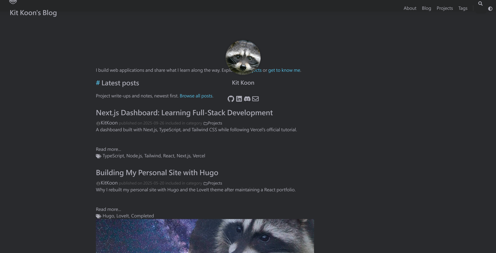

I wanted to update Hugo, but my main question was whether it would break my blog. I liked how the site looked and didn't want to rebuild the whole thing just to use a newer version.

After some back and forth with an AI coding assistant, I ended up upgrading Hugo and moving from LoveIt to DoIt. The site was already on Cloudflare Pages, so I also had to get the build settings right there.

I wrote about [the original Hugo setup here](). This is how the update went.

## Why I moved to DoIt

We tried the existing LoveIt setup with Hugo 0.166.0, and the build failed. Updating only the Hugo version wasn't going to work with that setup.

DoIt is based on LoveIt and looks similar, which was what I wanted. I could keep the layout, dark mode, navigation, and raccoon without starting over.

We ended up with these versions:

| Component | Before | After |
| --- | --- | --- |
| Hugo Extended | 0.145.0 | 0.166.0 |
| Theme | LoveIt | DoIt v1.0.2 |

Both are pinned, so the next update will be a separate change I can test on a branch.

## The vibe coding part

I asked the assistant to look through the repo, compare the themes, and make the changes. It updated the config, switched search to Fuse.js, and added a build script and GitHub build check.

There were a few smaller fixes along the way: missing post covers, the raccoon logo's alignment, and the header on narrow screens. Search was also returning the same page more than once. We fixed that with a template that gives each page one search result and removes the `0001` date from undated pages.

I reviewed the result, tried it locally, and handled the Cloudflare settings and pull request. When the deployment failed, I pasted the logs back into the conversation so we could figure out what was wrong.

## Keeping the old links and RSS working

The site had eight posts and 68 generated HTML page paths before this update. The checks confirmed that the old paths and post dates stayed the same. Search, images, mobile layout, dark mode, and comments were checked too.

I also asked about RSS because I wanted to keep using `/posts/index.xml`. I opened `http://localhost:1313/posts/index.xml` locally and it worked. The [public feed](/posts/index.xml) keeps the same address, so existing subscribers don't need to change anything.

Utterances comments use the page path to find the matching GitHub issue. We kept the same paths and comment repository so those connections would stay in place.

## Cloudflare kept installing the old Hugo

The local build and GitHub check passed, but the Cloudflare preview failed. Its log said:

```text
Installing hugo extended_0.145.0
```

The script expected 0.166.0, so it stopped the build. I changed the version setting and retried, but the next log still showed 0.145.0.

The setting to check was in **Preview**. Cloudflare has separate Preview and Production settings, and my branch was using Preview. The `.hugo-version` file in the repo didn't set Cloudflare's installer version for me.

These are the settings for the updated site, with `HUGO_VERSION` set in both environments:

| Cloudflare Pages setting | Value |
| --- | --- |
| Build command | `bash scripts/build.sh --gc` |
| Output directory | `public` |
| Environment variable | `HUGO_VERSION=0.166.0` |

Once that was sorted, the preview deployed. Both checks passed, I merged into `master`, and we checked that the live site was running the new version and still serving the RSS feed.

## One last surprise: the browser cache

Then I opened the deployed site and saw this. The raccoon was overlapping the introduction and the spacing looked wrong. After getting the build to pass, I thought something had still broken.



I cleared the browser cache, refreshed, and the layout was fine.

## References

- [Hugo 0.166.0 release](https://github.com/gohugoio/hugo/releases/tag/v0.166.0)
- [DoIt v1.0.2 release](https://github.com/HEIGE-PCloud/DoIt/releases/tag/v1.0.2)
- [Cloudflare Pages: choosing a Hugo version](https://developers.cloudflare.com/pages/framework-guides/deploy-a-hugo-site/#use-a-specific-or-newer-hugo-version)
- [This site's source](https://github.com/ChrisWK51/ChrisWK51)
- [Build and deployment instructions](https://github.com/ChrisWK51/ChrisWK51/blob/master/docs/site-maintenance.md)
